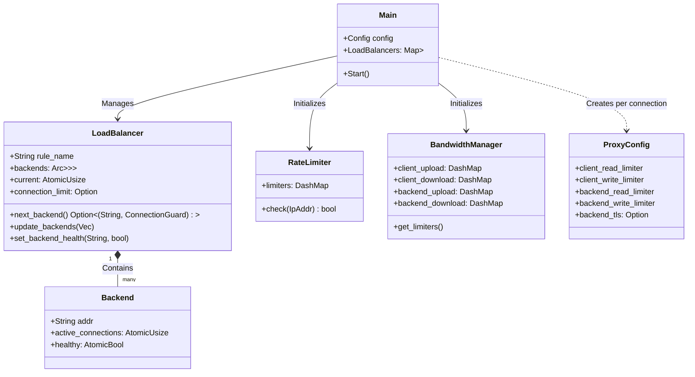
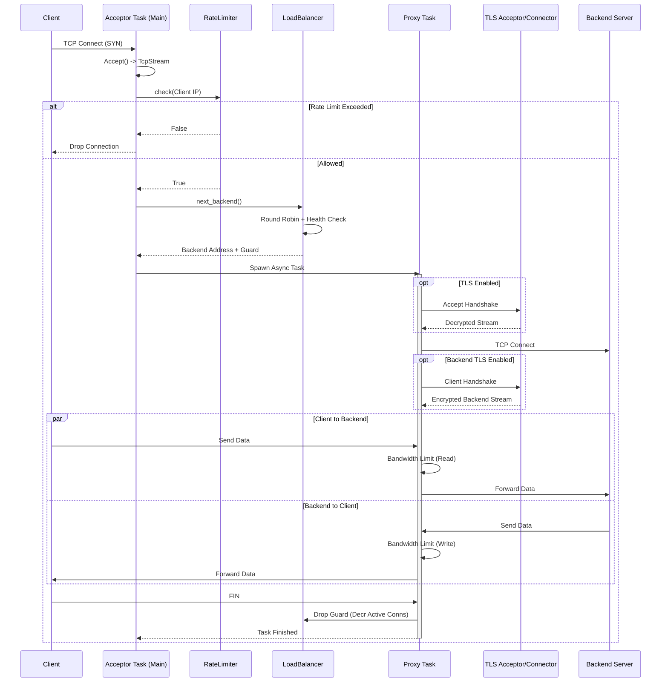

# Low Level Design (LLD)

This document provides a comprehensive deep-dive into the architecture, data structures, and interaction flows of the Layer 4 Load Balancer.

## 1. High-Level Class Architecture

The following class diagram illustrates the core components and their relationships. The application relies heavily on `Arc<T>` for shared state across asynchronous Tokio tasks.

## 2. Request Processing Flow (Sequence Diagram)

This sequence diagram details the lifecycle of a single connection request, from TCP Accept to Connection Close.

## 3. Core Module Deep Dive

### 3.1 Load Balancer (`core/balancer.rs`)

The `LoadBalancer` struct is the heart of the distribution logic.

* **Concurrency Strategy**:
  * It uses **`ArcSwap`** for the list of backends. This allows the internal pointer to be swapped atomically without locking readers (the Acceptor tasks). This is critical for high-throughput (wait-free reads).
  * `AtomicUsize` is used for the round-robin index. `fetch_add` is a cheap CPU atomic instruction.
  * `Backend` state (`healthy`, `active_connections`) is stored in `Arc<Atomic...>` independent of the list, allowing in-place updates without swapping the entire list.

### 3.2 Rate Limiting (`traffic/limiter.rs`)

* **Algorithm**: Token Bucket (GCRA - Generic Cell Rate Algorithm).
* **Storage**: `DashMap<IpAddr, RateLimiter>`. `DashMap` provides shard-based locking, meaning locking an IP `1.2.3.4` does not block `5.6.7.8`.
* **Fast Path**: If rate limiting is disabled in config, the `check` method returns `true` immediately (branch prediction friendly).

### 3.3 Bandwidth Management (`traffic/bandwidth.rs`)

This is implemented via a custom **Async Stream Wrapper**: `RateLimitedStream`.

* **Mechanism**:
  * Wraps `AsyncRead` and `AsyncWrite`.
  * **Chunking**: IO is split into 16KB chunks to balance locking overhead and smoothness.
  * **Precise Sleeping**: If tokens are insufficient, it calculates the exact duration needed to refill the required amount and sleeps asynchronously.
  * **Burst Support**: A 64KB burst buffer allows accumulating tokens to handle system timer jitter (1ms resolution) without dropping average throughput.
* **Flow**:
  1. Check if a permit is already pending.
  2. If not, calculate tokens needed for next chunk (min(remaining, 16KB)).
  3. Call `limiter.check_n(tokens)`.
  4. If `Err` (not enough): Calculate sleep time, create a future, and return `Poll::Pending`.
  5. If `Ok`: Proceed to IO.

### 3.4 Networking & Copying (`networking/proxy.rs`)

* **Zero-Copy(ish)**: We use `tokio::io::copy_bidirectional`. Under the hood, this uses splice (on Linux) or efficient user-space buffers.
* **Nagle's Algorithm**: We explicitly disable Nagle (`set_nodelay(true)`) on both sides to minimize latency for small packets.

## 4. Clustering & Distributed State (`cluster/mod.rs`)

To support multiple Load Balancer instances syncing state (e.g., Rate Limits), we use the **SWIM Protocol** via the `foca` crate.

* **Architecture**:
  * Running on a separate UDP port (default 9090).
  * **Gossip**: Periodically selects random peers to exchange "Usage Updates".
  * **Failure Detection**: Indirect pinging to detect dead nodes.
* **Consistency**: Eventual consistency. It does not replace Redis for strict counting but is sufficient for approximate global rate limiting.

## 5. Hot Reloading (`main.rs`)

We use the `notify` crate to watch the configuration file.

* **Handling**:
    1. File Modify Event detected.
    2. Main thread reads new config to memory.
    3. Iterates over existing Rules.
    4. Calls `LoadBalancer::update_backends()`.
    5. The `ArcSwap` is updated.
    6. New connections immediately see new backends. Old connections continue on their existing backend until closed.
